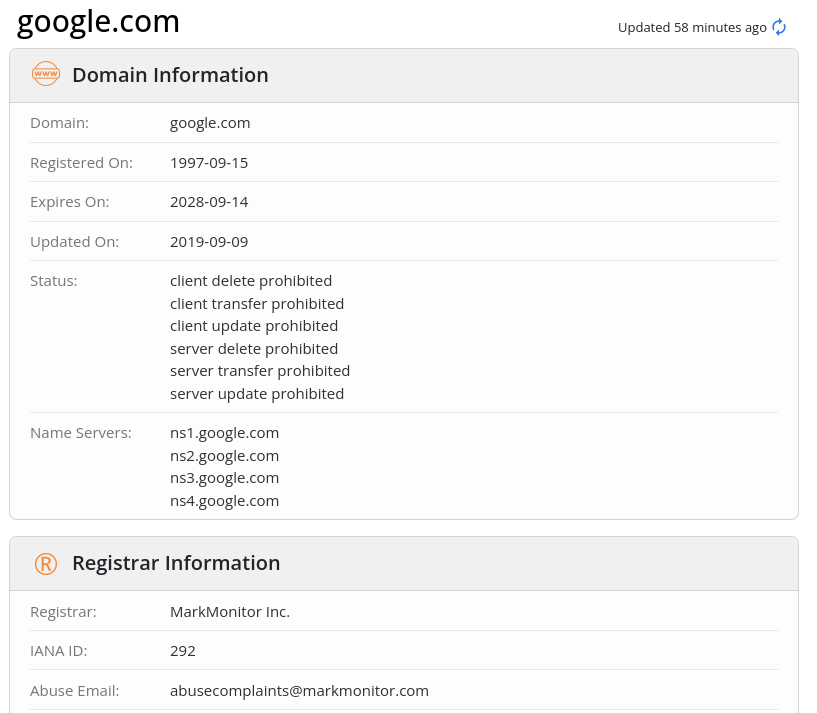
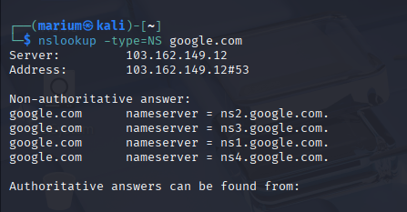
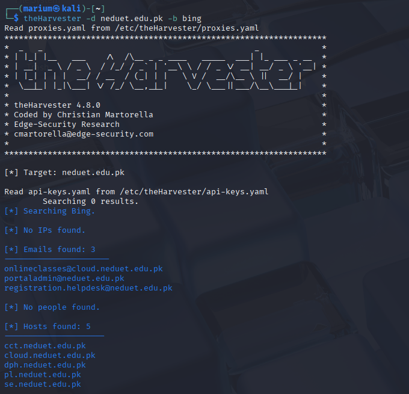
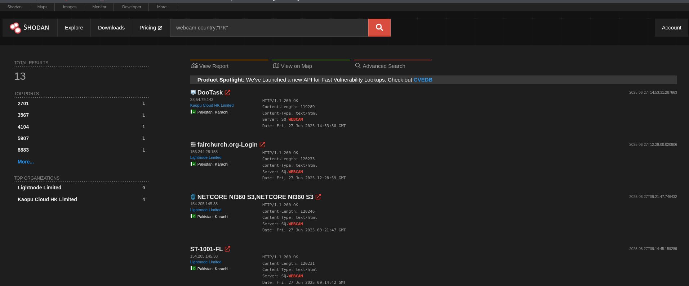
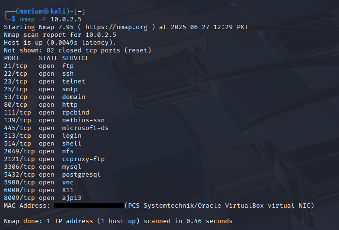

# 🕵️‍♀️ Footprinting and Reconnaissance – Week 2

This week focused on understanding how attackers gather information about their targets **before launching an attack**. This phase is crucial in ethical hacking, as it helps reveal potential vulnerabilities without directly engaging the target system (passive) or by actively interacting with it (active).

---

## 📘 Topics Covered

- Passive vs Active Reconnaissance
- Information Gathering Techniques
- Domain, Subdomain & Email Harvesting
- Open Port & Service Discovery
- Usage of tools like `whois`, `nslookup`, `theHarvester`, `Shodan`, `nmap`

---

## 🕸️ Reconnaissance Types

### 🔹 Passive Reconnaissance
- **No direct interaction** with the target.
- Uses publicly available information (OSINT).
- Tools: `whois`, `nslookup`, `theHarvester`, `Shodan`

### 🔹 Active Reconnaissance
- **Directly interacts** with the target.
- May trigger detection (firewalls, IDS).
- Tools: `nmap`, `traceroute`, etc.

---

## 🧪 Tools Used for Footprinting

### 🔹 `whois`
- Retrieves domain ownership, registration, and expiry details.
- Useful to identify the organization or admin managing the domain.

---

### 🔹 `nslookup`
- Performs DNS lookups to get IPs, nameservers, mail servers, etc.
- Helps map the target’s domain infrastructure.

---

### 🔹 `theHarvester`
- Collects emails, subdomains, and hosts from public sources like Google, Bing, LinkedIn, etc.
- Great for **email footprinting** and **subdomain discovery**.

---

### 🔹 `Shodan.io`
- A search engine for internet-connected devices.
- Can identify open ports, vulnerabilities, and banners (e.g., server versions).
- Helps understand the tech stack and services exposed.

---

### 🔹 `nmap`
- Scans a target for **open ports**, **running services**, and even **OS detection**.
- Used in the **active phase** to map the attack surface.

---

## 🔎 Example Findings

| Tool          | Information Discovered |
|---------------|-------------------------|
| `whois`       | Domain registrar, admin contact, expiry date |
| `nslookup`    | IP addresses, mail servers, DNS records     |
| `theHarvester`| Emails, subdomains from public sources      |
| `Shodan`      | Public services, server banners, open ports |
| `nmap`        | List of open ports, running services         |

---

## 🧠 Key Learnings

- Understood the difference between **passive** and **active** information gathering.
- Learned to use **OSINT tools** to collect useful data without alerting the target.
- Practiced scanning live systems and identifying open services.
- Built a strong base for further attack planning and vulnerability scanning.
