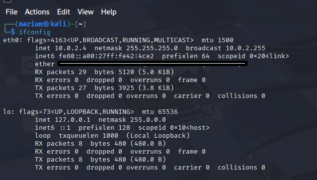
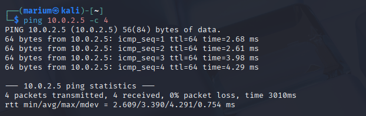
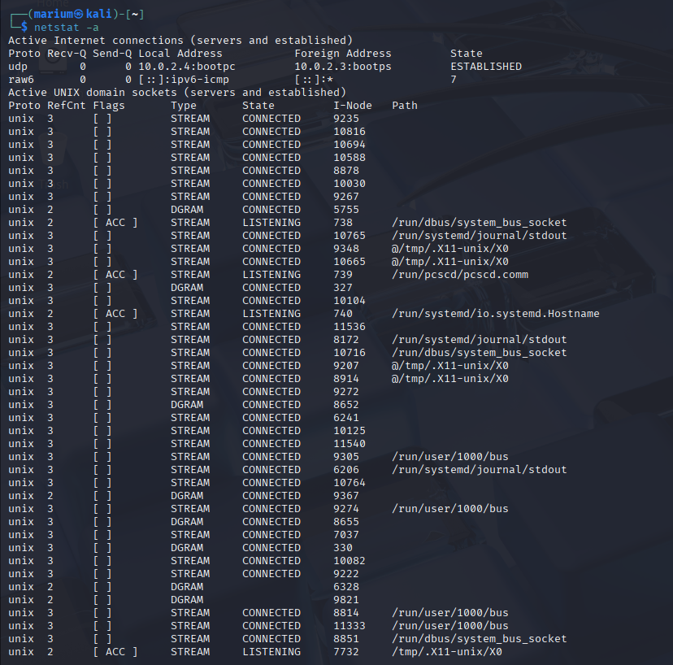
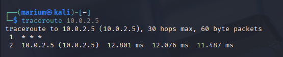

# 🌐 Networking Basics

This section covers the core networking concepts and hands-on practice using essential Linux tools. The goal was to understand how network communication works and to analyze it practically.

## 🔌 Core Networking Protocols

### 1. **IP Address (Internet Protocol)**
- A unique address assigned to each device on a network.
- Used for identifying devices and routing data.
- Example: `192.168.56.101`

### 2. **MAC Address (Media Access Control)**
- A hardware address assigned to a network interface card (NIC).
- Used for device-level identification on a local network.

### 3. **DNS (Domain Name System)**
- Converts domain names (like google.com) into IP addresses.
- Helps users access websites without remembering numeric IPs.

### 4. **DHCP (Dynamic Host Configuration Protocol)**
- Automatically assigns IP addresses to devices on a network.
- Ensures no IP conflicts and simplifies network management.

### 5. **TCP/IP Model**
- A 4-layer networking model that defines how data travels:
  - Application Layer
  - Transport Layer
  - Internet Layer
  - Network Access Layer

## 📦 Understanding Ports, Services & Packet Structure

- **Ports**: Logical endpoints for network services.
  - Example: Port 80 → HTTP, Port 22 → SSH
- **Services**: Applications that listen on ports (e.g., Apache on port 80).
- **Packet Structure**: Each packet contains headers and payloads.
  - Analyzed using **Wireshark** to view packet-level communication.

## 🔧 Linux Networking Tools Used

### 🔹 `ifconfig`
- Shows current IP, MAC, subnet mask, etc.
- Used to verify network interface configuration.

### 🔹 `ping`
- Sends ICMP Echo Requests to check if a host is reachable.
- Used to test connectivity between Kali and Metasploitable.

---

### 🔹 `netstat`
- Displays active network connections and listening ports.
- Helps identify open services and their states (e.g., LISTENING, ESTABLISHED)

`

---

### 🔹 `traceroute`
- Traces the path packets take to reach a destination.
- Useful for diagnosing routing issues and delays.

---

### 🔹 `nmap`
- Network scanning tool used to discover live hosts and open ports.
- Can detect services and OS info on targets.

## 🧠 Learnings

- Understood how IP/MAC/DNS/DHCP work together to enable networking.
- Learned practical usage of Linux tools to analyze and scan networks.
- Gained basic exposure to packet analysis using Wireshark.

