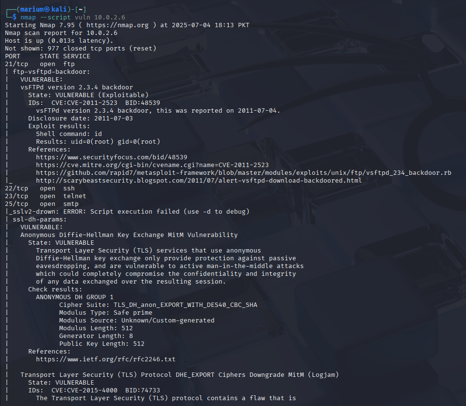
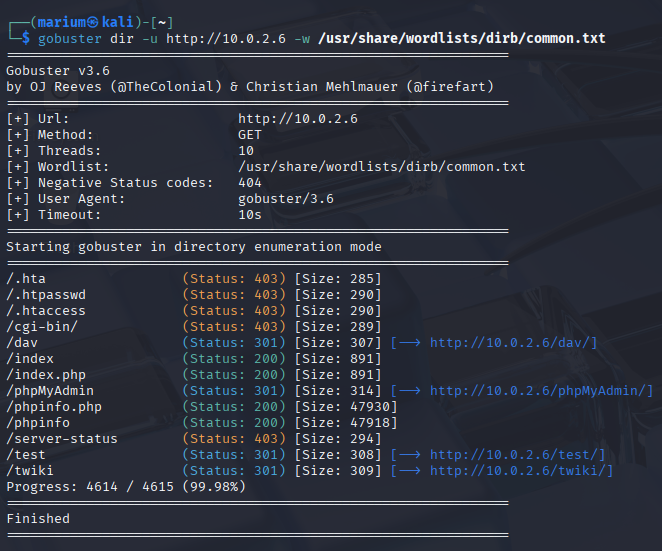

# 🧪 Hands-On Task – Week 2

This section includes two practical exercises: cracking a password-protected file using a dictionary attack, and performing thorough enumeration on a vulnerable Linux system and web environment. These tasks simulate real-world ethical hacking activities.

---

## 🔐 Task 1: Crack a Password-Protected ZIP or PDF File

### 🔹 Objective  
Use a dictionary attack to recover the password of a protected ZIP or PDF file using the `rockyou.txt` wordlist.

### 🔹 Tools Used  
- `zip2john` – Converts ZIP file hash into a John-readable format  
- `John the Ripper` – Performs dictionary attack  
- Wordlist: `/usr/share/wordlists/rockyou.txt


---

## 🕵️ Task 2: Perform Enumeration on a Vulnerable Linux System

### 🔹 Objective

Gather detailed information about a target system to uncover weak points, user details, and services that could be exploited.

---

### 🛰️ 1. Network & OS Enumeration (Using Nmap)

```bash
nmap -sV -O <target_ip>           # Version + OS detection
nmap --script vuln <target_ip>  # Run NSE script
```




---

### 🌐 2. Web Enumeration (Nikto, Dirb, Gobuster)

```bash
nikto -h http://<target_ip>
dirb http://<target_ip>
gobuster dir -u http://<target_ip> -w /usr/share/wordlists/dirb/common.txt
```




---

## 🧠 Learnings

* Understood and applied dictionary attacks to recover passwords from ZIP files.
* Performed complete enumeration of a target system, including network services, OS details and web application directories.
* Strengthened practical command-line skills and reconnaissance workflows using real-world tools and vulnerable environments.

---
