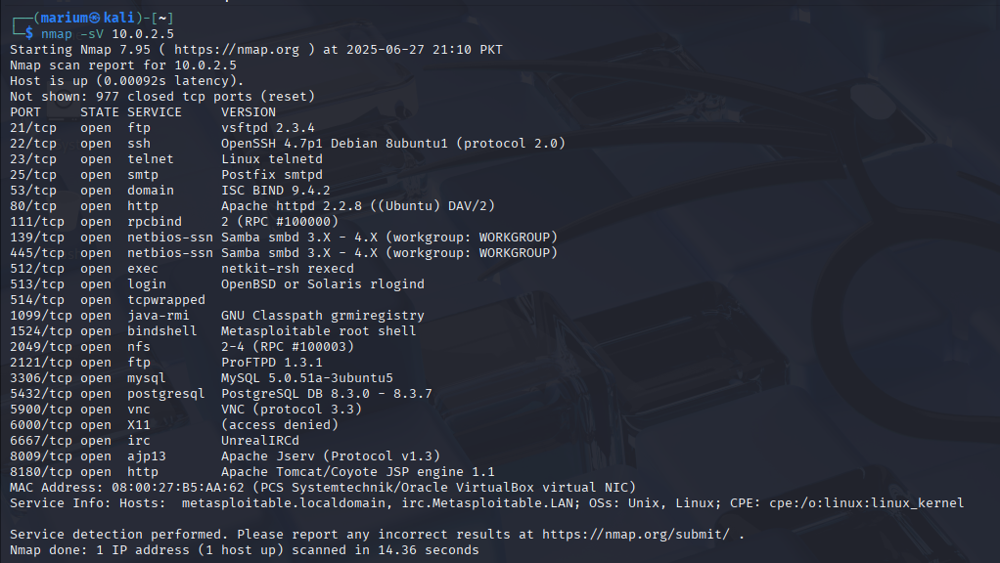
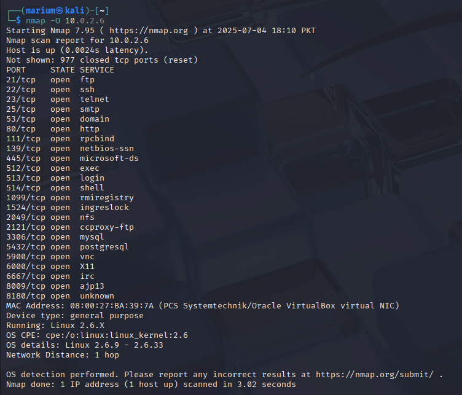
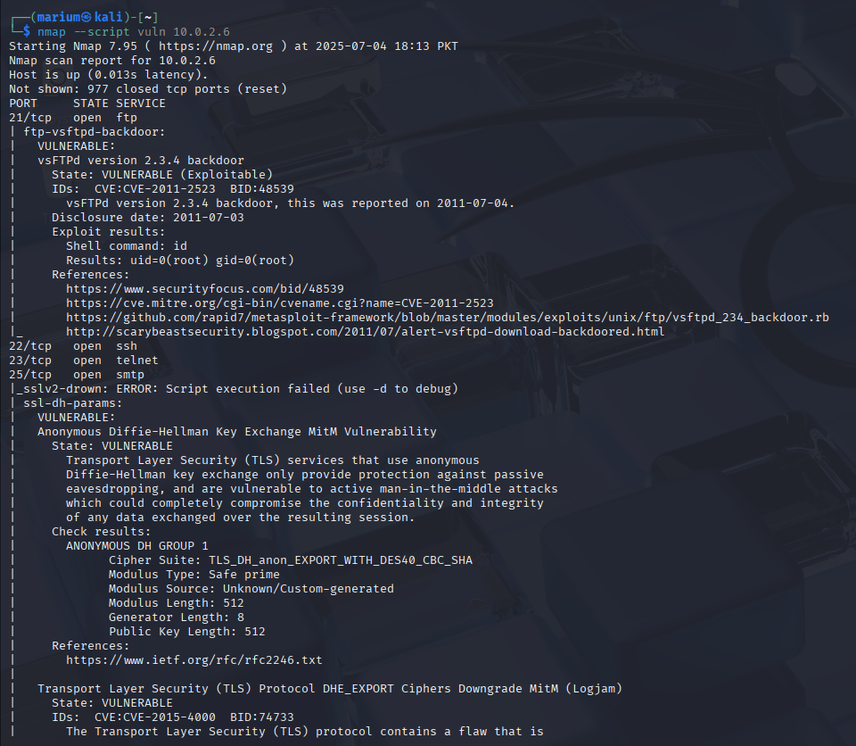
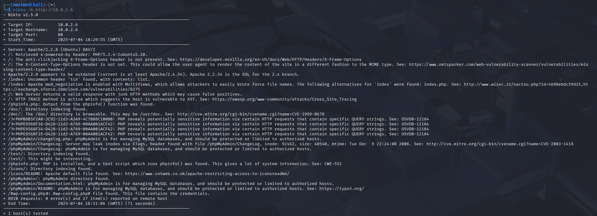
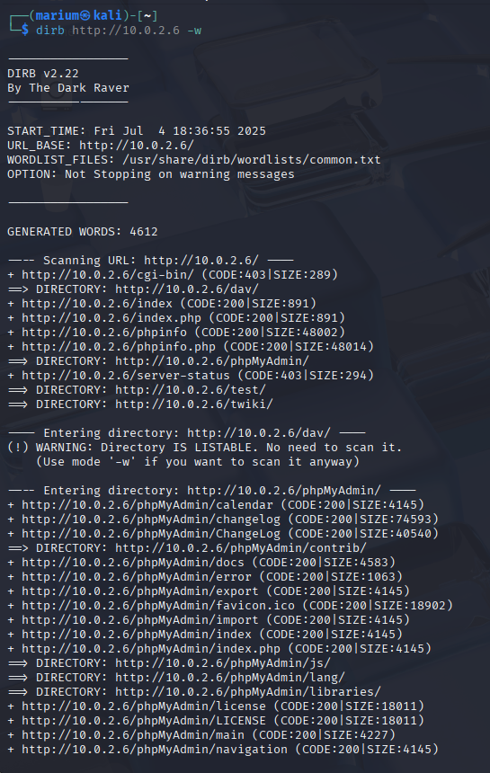
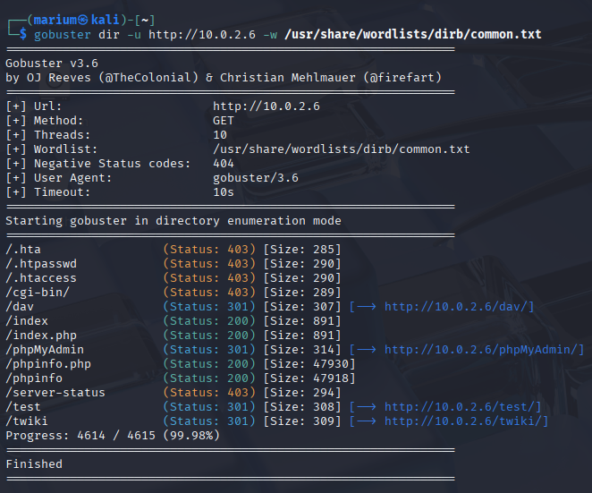

# 🔍 Scanning & Enumeration – Week 2

This section covers advanced scanning techniques and enumeration tools used to extract detailed information about target systems. The goal was to identify running services, operating systems, open directories, and possible vulnerabilities.

---

## 🛰️ Advanced Nmap Scanning

### 1. **Service and Version Detection**
- Identifies the version of services running on open ports.
- Helps in determining possible vulnerabilities based on outdated versions.

### 2. **Operating System Detection**

* Attempts to identify the target’s operating system.
* Useful for tailoring future exploits.

### 3. **Nmap Scripting Engine (NSE)**

* Runs built-in scripts to extract specific information (e.g., HTTP titles, vulnerabilities, etc.)

---

## 🧭 Web Directory & Vulnerability Scanning

### 🔹 **Nikto**

* A web server vulnerability scanner.
* Scans for outdated software, dangerous files, and misconfigurations.

---

### 🔹 **Dirb**

* Brute-forces directories and files on a web server using a wordlist.

---

### 🔹 **Gobuster**

* Faster alternative to Dirb for discovering directories and files.
* Uses wordlists and supports DNS/virtual host enumeration as well.

---

## 🧠 Learnings

* Performed advanced scanning with Nmap including version and OS detection.
* Used Nmap scripting for gathering additional intelligence.
* Explored web server vulnerabilities and hidden directories using Nikto, Dirb, and Gobuster.
* Understood the value of enumeration in identifying weak entry points.

---
