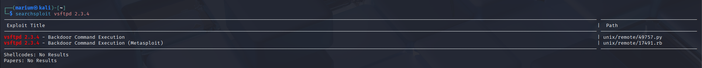
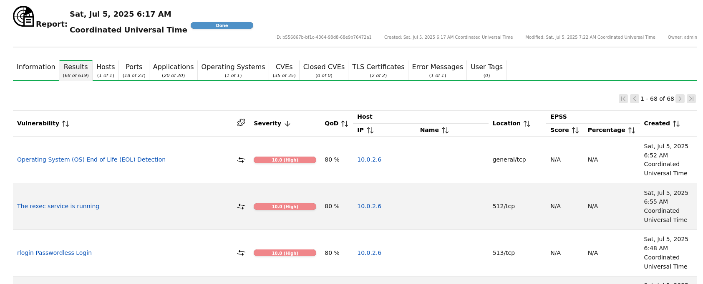
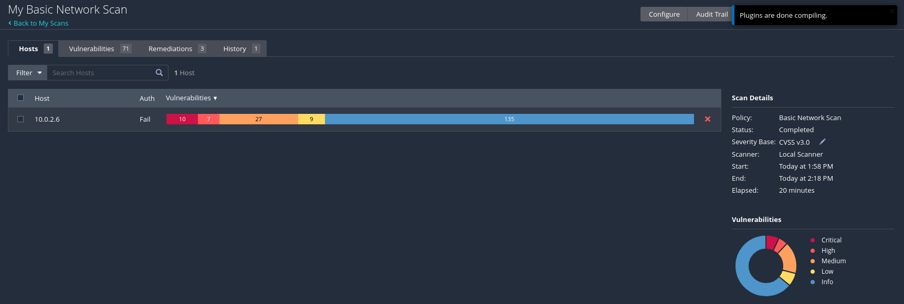

# 🛠️ Vulnerability Analysis – Week 2

This section focuses on identifying and analyzing system vulnerabilities using known exploit databases and vulnerability scanning tools. The goal was to search for public exploits, access vulnerabilities in target systems, and understand how Common Vulnerabilities and Exposures (CVEs) are classified and used.

---

## 🔎 Searchsploit – Exploit-DB 

### 🔹 Purpose
- Used `Searchsploit` to search for known exploits from the local copy of Exploit-DB.
  

---

## 🔍 Vulnerability Scanning with OpenVAS / Nessus

### 1. **OpenVAS**

* Open-source vulnerability scanner that identifies misconfigurations, missing patches, and CVEs.

🟢 Tasks Performed:

* Launched a full and fast system scan
* Analyzed discovered vulnerabilities

---

### 2. **Nessus** 

* Used for professional vulnerability scanning and CVSS scoring.
* Detected outdated services and exposed ports with severity levels.

---

## 🧾 Understanding CVEs

* **CVE (Common Vulnerabilities and Exposures)** is a unique identifier assigned to known security flaws.
* Every CVE has:

  * An ID (e.g., `CVE-2021-3156`)
  * A description
  * A severity score (CVSS)
  * References to patches or exploits

### 🔹 CVE Lookup Resources

* [https://cve.org](https://cve.org)
* [https://nvd.nist.gov](https://nvd.nist.gov)
* [https://exploit-db.com](https://exploit-db.com)

---

## 🧠 Learnings

* Gained experience using `Searchsploit` to discover public exploits in Exploit-DB.
* Understood how to interpret vulnerability scanner results using OpenVAS and Nessus.
* Learned how CVEs are structured and how to use them in risk assessment.

---
