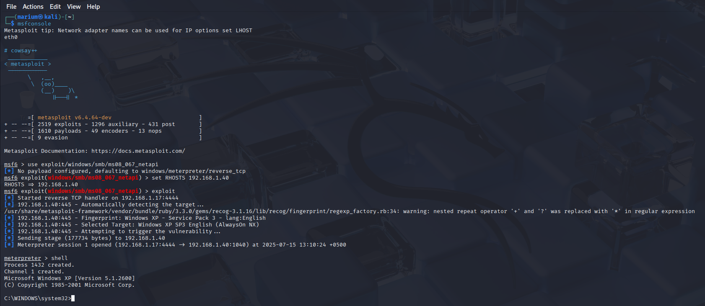

# 💥 Exploitation – Week 3 & 4

This section focuses on using exploitation frameworks to compromise vulnerable systems. 
---

## 🎯 Exploitation Frameworks

### 🔹 Objective  
Use **Metasploit** to exploit known vulnerabilities and gain shell access to Windows and Linux targets.

### 🔹 Tool Used: Metasploit Framework (`msfconsole`)  
A powerful and modular tool for searching, configuring, and launching exploits and payloads.

---

## 🛠️ Tasks Performed

- Started Metasploit framework using `msfconsole`
- Searched for available exploits relevant to target services
- Configured payloads (e.g., reverse TCP shell)
- Launched exploits against:
  - **Linux** 
  - **Windows** 

---

## 🧪 Linux Exploitation

---

## 🧪 Windows Exploitation

---

## 🧠 Learnings

* Gained hands-on experience with **Metasploit** to exploit both Linux and Windows systems
* Understood how to select and configure **payloads** and handle active sessions
* Practiced identifying vulnerable services and choosing appropriate **exploit modules**
* Learned real-world attack chains in a safe environment

---
