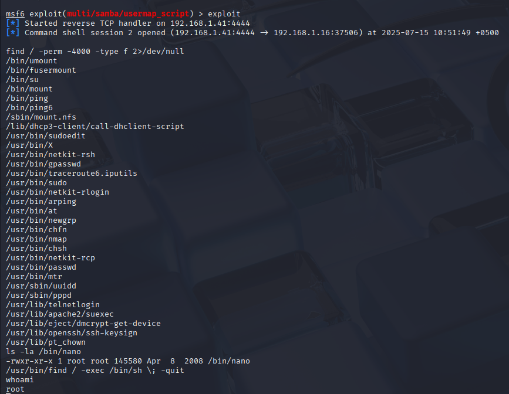
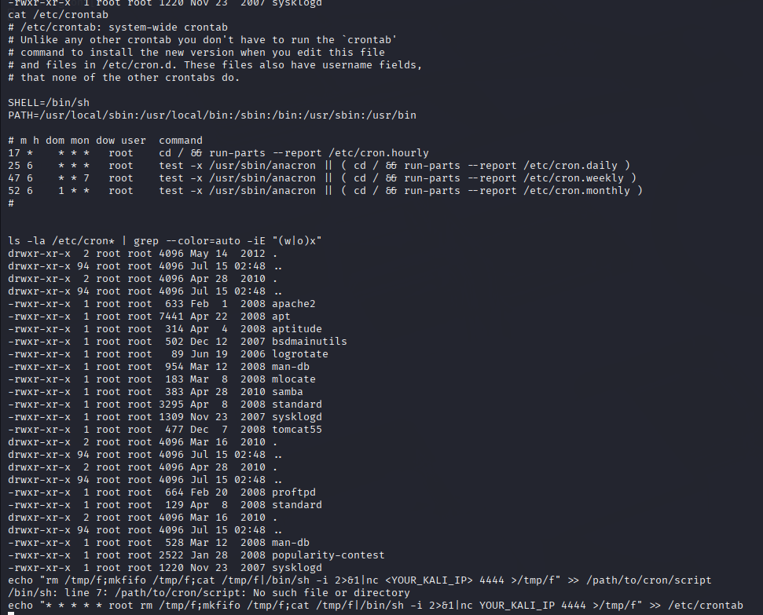
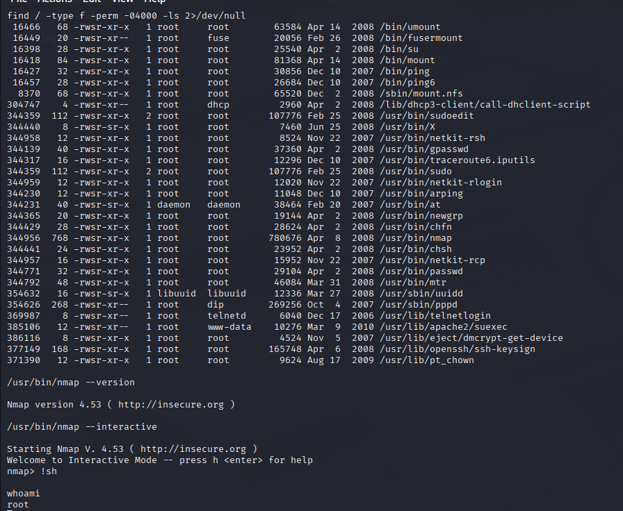
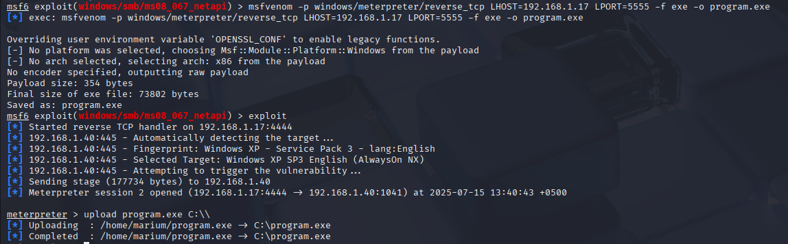

# 🔐 Privilege Escalation – Week 3 & 4

This section focuses on post-exploitation techniques that allow an attacker to escalate privileges and gain higher-level access to compromised systems. The task covers both Linux and Windows privilege escalation vectors in a controlled lab environment.

---

## 🐧 Linux Privilege Escalation

### 🔹 Objective  
Escalate user-level access to root by identifying misconfigurations and exploitable settings.

### 🔹 Techniques Explored

- **SUID Binaries** – Misconfigured binaries with root permissions
  
  

---
  
- **Scheduled Cron Jobs** – Writable scripts executed by root

  

---

- **Environment Variables** – Manipulating variables to hijack execution

  

---

## 🪟 Windows Privilege Escalation

### 🔹 Objective

Escalate user privileges on Windows using insecure configurations or services.

### 🔹 Techniques Explored

* **Unquoted Service Paths** – Misconfigured services with writable paths
* **Weak Service Permissions** – Exploiting permission misconfigurations
* **Access Tokens** – Using token manipulation 

---

---

## 🧠 Learnings

* Understood how attackers elevate access from normal users to root/administrator
* Practiced identifying common misconfigurations in Linux (SUID, cron, env)
* Exploited real-world Windows issues like unquoted service paths 
* Strengthened post-exploitation techniques in ethical hacking labs

---
