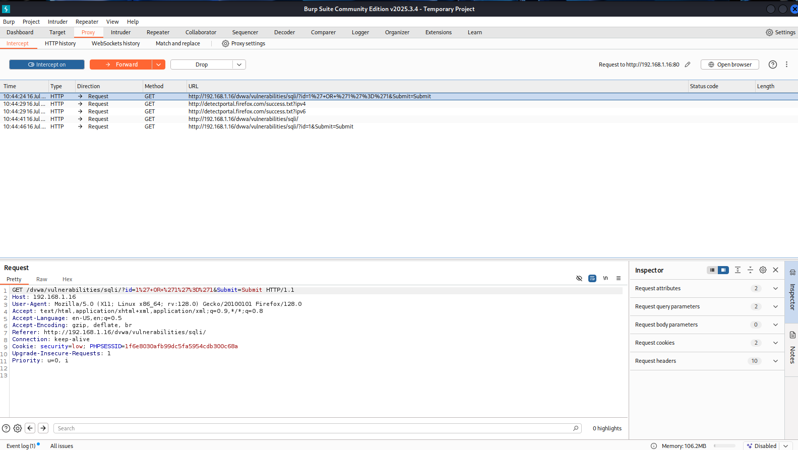
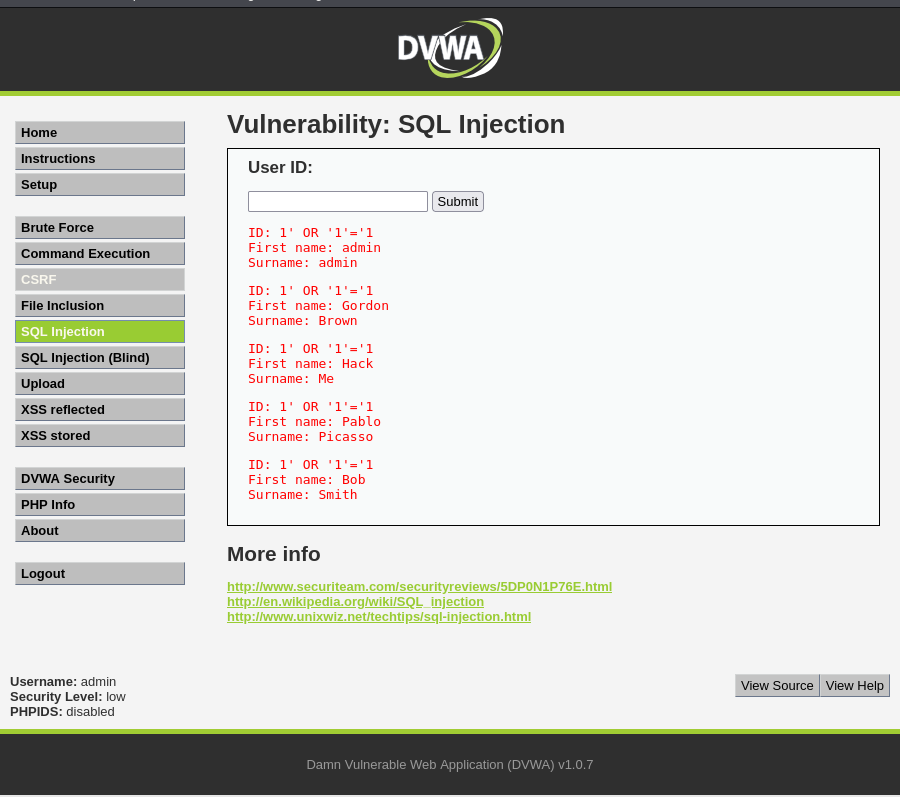
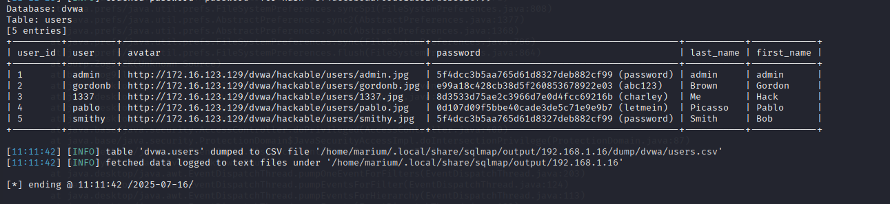

# 🛡️ Web Application Hacking: Burp Suite + SQL Injection

This project demonstrates how to perform manual and automated SQL Injection attacks using Burp Suite and sqlmap on DVWA (Damn Vulnerable Web Application) hosted on Metasploitable2.

---

## 🧪 Objectives

- Understand OWASP Top 10 Vulnerabilities 
- Use **Burp Suite** to intercept and modify HTTP requests
- Perform SQL Injection manually and with **sqlmap**
- Analyze and extract database information from a vulnerable web application

---

## 🔧 Setup

- **Attacker VM**: Kali Linux  
- **Target VM**: Metasploitable2 (IP used: `192.168.1.16`)
- **Tool Used**:
  - Burp Suite
  - sqlmap
  - DVWA (on Metasploitable2)

---

## 🔐 OWASP Top 10 

- **01: Broken Access Control** – Fails to restrict user actions, allowing unauthorized access.  
- **02: Cryptographic Failures** – Weak or misused encryption exposes sensitive data.  
- **03: Injection** – Untrusted data sent to an interpreter (e.g., SQL, OS commands).  
- **04: Insecure Design** – Flaws in architecture/design lead to security risks.  
- **05: Security Misconfiguration** – Poorly configured apps/servers (e.g., defaults, verbose errors).  
- **06: Vulnerable & Outdated Components** – Using dependencies with unpatched vulnerabilities.  
- **07: Identification & Auth Failures** – Weak login systems (e.g., brute force, poor session handling).  
- **08: Software & Data Integrity Failures** – Untrusted code/data bypasses checks (e.g., CI/CD flaws).  
- **09: Security Logging & Monitoring Failures** – Missing threat detection enables breaches.  
- **10: Server-Side Request Forgery (SSRF)** – Forges server requests to access/internal systems.

---

## 🔹 Burp Suite: Intercepting & Modifying Requests

- Configured Firefox browser to use Burp Suite as proxy (`127.0.0.1:8080`)
- Intercepted HTTP GET request sent from DVWA's SQL Injection module
- Modified the parameter `id=1` to a payload: `id=1' OR '1'='1`
- Forwarded request to the server and confirmed vulnerable response

---

## 🤖 SQL Injection Using sqlmap

- Saved modified Burp request to file `dvwa.req`

---

### 🔍 Data Dump Example

---

##🧠 Learnings

- Gained hands-on experience with web vulnerabilities like XSS, SQLi, and CSRF
- Learned to intercept and manipulate web traffic using Burp Suite
- Exploited SQL Injection both manually and using sqlmap
- Developed better understanding of how insecure coding practices lead to serious flaws

---
